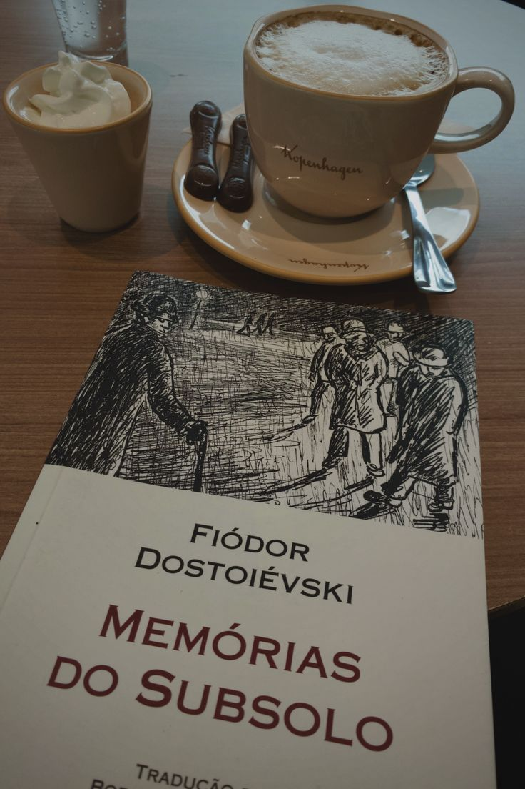
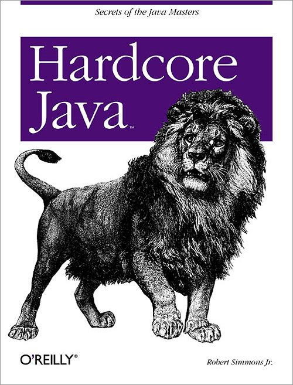
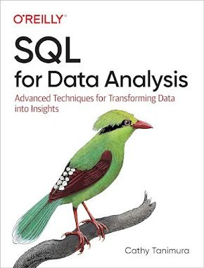

# Future and Knowledge Bookstore

Projeto Frontend desenvolvido com React + Vite para fins educacionais, simulando uma livraria virtual moderna com navegação entre páginas, categorias de livros e layout responsivo.

---

# Tecnologias Utilizadas

- React
- Vite
- React Router DOM
- JavaScript
- CSS3
- HTML5
- Git e GitHub

---

# Funcionalidades

✅ Página Home  
✅ Página Detalhes  
✅ Página Categoria  
✅ Página Login  
✅ Navegação entre páginas  
✅ Layout responsivo  
✅ Componentização React  
✅ Footer fixado corretamente  
✅ Cards de categorias  
✅ Imagens locais na pasta assets  

---

# Preview do Projeto

## Página Inicial


---

## Categoria História



---

## Categoria Java



---

## Categoria SQL



---

# Estrutura do Projeto

```bash
src
├── assets
├── components
├── pages
├── routes
├── App.jsx
├── main.jsx 

## Acesso Local

Local: http://localhost:5173/

## Objetivo

Este projeto foi desenvolvido exclusivamente para estudos e prática de desenvolvimento Frontend utilizando React.

## Autor

Luiz Antônio Asevedo


